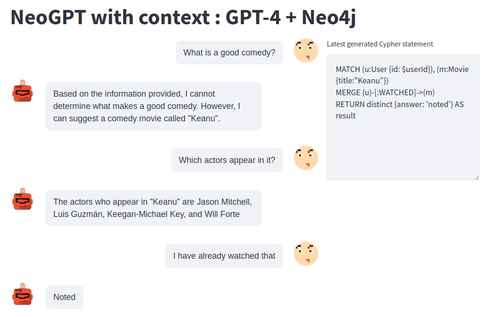

# NeoGPT-Recommender

Idea behind this repository is to create a context-aware chatbot that can read from and update a Neo4j database.
The Cypher is generated using GPT-4 endpoint, while the answers are generated with gpt-3.5-turbo model based on the information from the database.

Learn more: https://medium.com/neo4j/context-aware-knowledge-graph-chatbot-with-gpt-4-and-neo4j-d3a99e8ae21e

## Neo4j database

The project uses the [Recommendation project](https://sandbox.neo4j.com/?usecase=recommendations) that is available as part of the Neo4j Sandbox.
If you want a local instance of Neo4j, you can restore a database dump that is available [here](https://github.com/neo4j-graph-examples/recommendations/tree/main/data).

## Environment variables

Make sure to populate the environment variables as shown in the `.env.example` file

## Start the project

Run the project using

```
docker-compose up
```

and then open the localhost:8501 address in your favourite browser



## Training examples for the english2cypher part

You can use the following example to get an idea what this chatbot is capable of

```
# I don't like comedy
MATCH (u:User {id: $userId}), (g:Genre {name:"Comedy"})
MERGE (u)-[:DISLIKE_GENRE]->(g)
RETURN distinct {answer: 'noted'} AS result
# I like comedy
MATCH (u:User {id: $userId}), (g:Genre {name:"Comedy"})
MERGE (u)-[:LIKE_GENRE]->(g)
RETURN distinct {answer: 'noted'} AS result
# I have already watched Top Gun
MATCH (u:User {id: $userId}), (m:Movie {title:"Top Gun"})
MERGE (u)-[:WATCHED]->(m)
RETURN distinct {answer: 'noted'} AS result
# I like Top Gun
MATCH (u:User {id: $userId}), (m:Movie {title:"Top Gun"})
MERGE (u)-[:LIKE_MOVIE]->(m)
RETURN distinct {answer: 'noted'} AS result
# What is a good comedy?
MATCH (u:User {id:$userId}), (m:Movie)-[:IN_GENRE]->(:Genre {name:"Comedy"})
WHERE NOT EXISTS {(u)-[:WATCHED]->(m)}
RETURN {movie: m.title} AS result
ORDER BY m.imdbRating DESC LIMIT 1
# Who played in Top Gun?
MATCH (m:Movie)<-[:ACTED_IN]-(a)
RETURN {actor: a.name} AS result
# What is the plot of the Copycat movie?
MATCH (m:Movie {title: "Copycat"})
RETURN {plot: m.plot} AS result
# Did Luis Guzmán appear in any other movies?
MATCH (p:Person {name:"Luis Guzmán"})-[:ACTED_IN]->(movie)
RETURN {movie: movie.title} AS result
# Do you know of any matrix movies?
MATCH (m:Movie)
WHERE toLower(m.title) CONTAINS toLower("matrix")
RETURN {movie:m.title} AS result
# Which movies do I like?
MATCH (u:User {id: $userId})-[:LIKE_MOVIE]->(m:Movie)
RETURN {movie:m.title} AS result
# Recommend a movie
MATCH (u:User {id: $userId})-[:LIKE_MOVIE]->(m:Movie)
MATCH (m)<-[r1:RATED]-()-[r2:RATED]->(otherMovie)
WHERE r1.rating > 3 AND r2.rating > 3 AND NOT EXISTS {(u)-[:WATCHED|LIKE_MOVIE|DISLIKE_MOVIE]->(otherMovie)}
WITH otherMovie, count(*) AS count
ORDER BY count DESC
LIMIT 1
RETURN {recommended_movie:otherMovie.title} AS result
```
